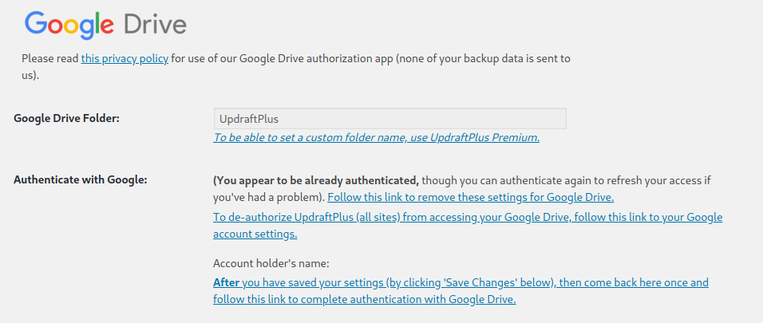

# ansible-automation
Automation of IT related tasks

## Install required roles

```sh
ansible-galaxy install -r requirements.yml
```

## Production mode

```sh
ansible-playbook --vault-id @prompt secret.yml playbook.yml
```

## Encrypt Sensitive Files

```sh
# Encrypt the secret file
ansible-vault encrypt --vault-id @prompt secret.yml

# View the content of the secret file, will ask for password
ansible-vault view secret.yml

# Decrypt the content of the secret file, will ask for password
ansible-vault decrypt secret.yml
```

## Developement mode

A [Vagrant](https://vagrantup.com) virtual machine can be used during development to safely test new configurations without modifying the production servers.

```sh
# Creates and run the virtual machine
vagrant up

# Export the ssh configuration to the development virtual machine
vagrant ssh-config --host vagrant > .ssh.config

# Test the ssh connection
ssh -F .ssh.config vagrant lsb_release -a

# Run the Ansible playbook on the Vagrant virtual machine
ansible-playbook --inventory hosts-dev --ssh-extra-args='-F .ssh.config' --vault-id @prompt secret.yml playbook.yml
```

### Get ssh logging info

```sh
sudo grep sshd /var/log/auth.log
```

```sh
w
 12:42:14 up 1 min,  1 user,  load average: 0.06, 0.04, 0.01
USER     TTY      FROM             LOGIN@   IDLE   JCPU   PCPU WHAT
vagrant  pts/0    10.0.2.2         12:41    1.00s  0.07s  0.00s w
```

### Wordpress backup info

The plugin used for backups of the wordpress documents and databases is
[UpDraftPlus](https://wordpress.org/plugins/updraftplus/). To change the google drive recipient 
account of the wordpress backups. You may go to the 
[settings](https://epicerieledetour.org/wp-admin/options-general.php?page=updraftplus) page.

Go to the `settings` tab showed below


Scroll down until you reach the `Google Drive` section


